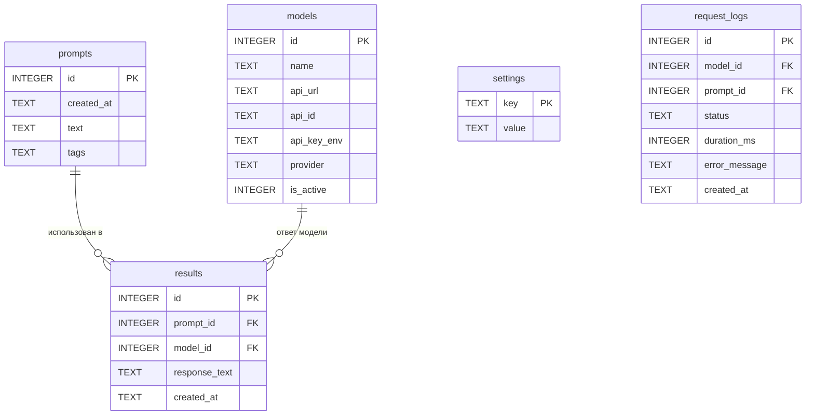

# Схема базы данных ChatList

База данных: **SQLite**.  
Файл по умолчанию: `data/chatlist.db` (путь настраивается через таблицу `settings`).

API-ключи **не хранятся** в БД — только имя переменной окружения (`api_key_env`). Сами ключи лежат в файле `.env`.

Временная таблица результатов текущего запроса хранится **в памяти приложения**, не в SQLite.

---

## ER-диаграмма



---

## Таблица `prompts`

Сохранённые запросы пользователя.

| Поле        | Тип     | Ограничения              | Описание                                      |
|-------------|---------|--------------------------|-----------------------------------------------|
| `id`        | INTEGER | PRIMARY KEY, AUTOINCREMENT | Уникальный идентификатор                    |
| `created_at`| TEXT    | NOT NULL                 | Дата и время создания (ISO 8601, UTC)         |
| `text`      | TEXT    | NOT NULL                 | Текст промта                                  |
| `tags`      | TEXT    |                          | Теги через запятую, напр. `python, api, test` |

**Индексы:**
- `idx_prompts_created_at` — сортировка по дате;
- `idx_prompts_text` — полнотекстовый или LIKE-поиск (опционально).

**Пример строки:**

| id | created_at           | text                              | tags        |
|----|----------------------|-----------------------------------|-------------|
| 1  | 2026-07-29T15:30:00Z | Объясни разницу между list и tuple | python, basics |

---

## Таблица `models`

Подключённые нейросети и параметры их API.

| Поле          | Тип     | Ограничения              | Описание                                           |
|---------------|---------|--------------------------|----------------------------------------------------|
| `id`          | INTEGER | PRIMARY KEY, AUTOINCREMENT | Уникальный идентификатор                         |
| `name`        | TEXT    | NOT NULL, UNIQUE         | Отображаемое имя (напр. «GPT-4o», «DeepSeek Chat») |
| `api_url`     | TEXT    | NOT NULL                 | Базовый URL API                                    |
| `api_id`      | TEXT    | NOT NULL                 | Идентификатор модели в API (напр. `gpt-4o`)        |
| `api_key_env` | TEXT    | NOT NULL                 | Имя переменной в `.env` (напр. `OPENAI_API_KEY`)   |
| `provider`    | TEXT    | NOT NULL, DEFAULT 'openai' | Тип провайдера: `openai`, `deepseek`, `groq` и т.д. |
| `is_active`   | INTEGER | NOT NULL, DEFAULT 1      | `1` — участвует в отправке, `0` — отключена        |

**Индексы:**
- `idx_models_is_active` — быстрый выбор активных моделей.

**Пример строки:**

| id | name         | api_url                                      | api_id      | api_key_env      | provider | is_active |
|----|--------------|----------------------------------------------|-------------|------------------|----------|-----------|
| 1  | GPT-4o       | https://api.openai.com/v1/chat/completions   | gpt-4o      | OPENAI_API_KEY   | openai   | 1         |
| 2  | DeepSeek Chat| https://api.deepseek.com/v1/chat/completions | deepseek-chat | DEEPSEEK_API_KEY | deepseek | 1       |

---

## Таблица `results`

Постоянно сохранённые ответы, отмеченные пользователем (`selected = True` во временной таблице).

| Поле            | Тип     | Ограничения              | Описание                              |
|-----------------|---------|--------------------------|---------------------------------------|
| `id`            | INTEGER | PRIMARY KEY, AUTOINCREMENT | Уникальный идентификатор            |
| `prompt_id`     | INTEGER | NOT NULL, FK → prompts(id) | Промт, к которому относится ответ   |
| `model_id`      | INTEGER | NOT NULL, FK → models(id)  | Модель, давшая ответ                |
| `response_text` | TEXT    | NOT NULL                 | Текст ответа нейросети                |
| `created_at`    | TEXT    | NOT NULL                 | Дата и время сохранения (ISO 8601)    |

**Внешние ключи:**
- `prompt_id` → `prompts(id)` ON DELETE CASCADE
- `model_id` → `models(id)` ON DELETE RESTRICT

**Индексы:**
- `idx_results_prompt_id`
- `idx_results_model_id`
- `idx_results_created_at`

**Пример строки:**

| id | prompt_id | model_id | response_text              | created_at           |
|----|-----------|----------|----------------------------|----------------------|
| 1  | 1         | 1        | List изменяем, tuple — нет… | 2026-07-29T15:35:00Z |

---

## Таблица `settings`

Key-value хранилище настроек приложения.

| Поле   | Тип  | Ограничения    | Описание          |
|--------|------|----------------|-------------------|
| `key`  | TEXT | PRIMARY KEY    | Ключ настройки    |
| `value`| TEXT |                | Значение (строка) |

**Примеры записей:**

| key              | value                    |
|------------------|--------------------------|
| `db_path`        | `data/chatlist.db`       |
| `request_timeout`| `60`                     |
| `window_width`   | `1200`                   |
| `window_height`  | `800`                    |

---

## Таблица `request_logs` (опционально)

Журнал HTTP-запросов к API. Реализуется при включении функции логирования.

| Поле           | Тип     | Ограничения              | Описание                                |
|----------------|---------|--------------------------|-----------------------------------------|
| `id`           | INTEGER | PRIMARY KEY, AUTOINCREMENT | Уникальный идентификатор              |
| `model_id`     | INTEGER | FK → models(id)          | Модель, к которой был запрос            |
| `prompt_id`    | INTEGER | FK → prompts(id), NULL   | Промт (если уже сохранён в `prompts`)   |
| `status`       | TEXT    | NOT NULL                 | `success`, `error`, `timeout`         |
| `duration_ms`  | INTEGER |                          | Длительность запроса в миллисекундах    |
| `error_message`| TEXT    |                          | Текст ошибки (если `status != success`) |
| `created_at`   | TEXT    | NOT NULL                 | Время запроса (ISO 8601)                |

---

## Временная таблица (в памяти, не SQLite)

Используется для отображения результатов текущего запроса до нажатия «Сохранить».

| Поле            | Тип     | Описание                                      |
|-----------------|---------|-----------------------------------------------|
| `model_id`      | int     | ID модели из таблицы `models`                 |
| `model_name`    | str     | Имя модели (для отображения)                  |
| `response_text` | str     | Текст ответа или сообщение об ошибке          |
| `selected`      | bool    | Отмечен ли пользователем для сохранения       |

**Жизненный цикл:**
1. Создаётся пустой список при новом промте.
2. Заполняется после получения ответов от всех активных моделей.
3. При «Сохранить» — строки с `selected = True` переносятся в `results`.
4. Список очищается после сохранения или при следующем промте.

---

## SQL: создание схемы

```sql
PRAGMA foreign_keys = ON;

CREATE TABLE IF NOT EXISTS prompts (
    id          INTEGER PRIMARY KEY AUTOINCREMENT,
    created_at  TEXT    NOT NULL,
    text        TEXT    NOT NULL,
    tags        TEXT    DEFAULT ''
);

CREATE TABLE IF NOT EXISTS models (
    id          INTEGER PRIMARY KEY AUTOINCREMENT,
    name        TEXT    NOT NULL UNIQUE,
    api_url     TEXT    NOT NULL,
    api_id      TEXT    NOT NULL,
    api_key_env TEXT    NOT NULL,
    provider    TEXT    NOT NULL DEFAULT 'openai',
    is_active   INTEGER NOT NULL DEFAULT 1
);

CREATE TABLE IF NOT EXISTS results (
    id            INTEGER PRIMARY KEY AUTOINCREMENT,
    prompt_id     INTEGER NOT NULL,
    model_id      INTEGER NOT NULL,
    response_text TEXT    NOT NULL,
    created_at    TEXT    NOT NULL,
    FOREIGN KEY (prompt_id) REFERENCES prompts(id) ON DELETE CASCADE,
    FOREIGN KEY (model_id)  REFERENCES models(id)  ON DELETE RESTRICT
);

CREATE TABLE IF NOT EXISTS settings (
    key   TEXT PRIMARY KEY,
    value TEXT
);

CREATE TABLE IF NOT EXISTS request_logs (
    id            INTEGER PRIMARY KEY AUTOINCREMENT,
    model_id      INTEGER NOT NULL,
    prompt_id     INTEGER,
    status        TEXT    NOT NULL,
    duration_ms   INTEGER,
    error_message TEXT,
    created_at    TEXT    NOT NULL,
    FOREIGN KEY (model_id)  REFERENCES models(id)  ON DELETE CASCADE,
    FOREIGN KEY (prompt_id) REFERENCES prompts(id) ON DELETE SET NULL
);

CREATE INDEX IF NOT EXISTS idx_prompts_created_at  ON prompts(created_at);
CREATE INDEX IF NOT EXISTS idx_models_is_active  ON models(is_active);
CREATE INDEX IF NOT EXISTS idx_results_prompt_id   ON results(prompt_id);
CREATE INDEX IF NOT EXISTS idx_results_model_id    ON results(model_id);
CREATE INDEX IF NOT EXISTS idx_results_created_at  ON results(created_at);
```

---

## Связи и бизнес-правила

1. **Промт → результаты:** один промт может иметь несколько сохранённых ответов (от разных моделей).
2. **Модель → результаты:** одна модель может фигурировать во многих результатах.
3. **Активные модели:** при отправке промта выбираются только записи `models` с `is_active = 1`.
4. **Ключи API:** перед запросом приложение читает `os.environ[api_key_env]`; если переменная пуста — запрос к этой модели пропускается или возвращается ошибка в временной таблице.
5. **Удаление промта:** каскадно удаляет связанные записи в `results`; в `request_logs.prompt_id` обнуляется (SET NULL).
6. **Удаление модели:** запрещено (`RESTRICT`), если есть сохранённые результаты; рекомендуется деактивировать (`is_active = 0`) вместо удаления.
